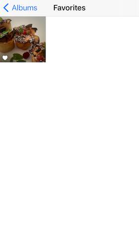
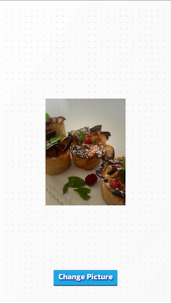

# Acces to the Camera Roll from a Defold application

## Overview
This project is much more a Proof Of Concept than a direct-to-use template.
It allows to use in a Defold application a photo from the smartphone as a texture (validated on iOS device, this should also work on Android device subject to special permissions to be granted to access local photos...).  
To do this, it uses a web view with a dedicated local html page and some magic stuff to communicate between the Defold and Webview universes....

Note:    
The html page contains a picture resizer function that can be set from the defold application (see the init lua function). This allows to reduce the length of base64 string used to exchange the picture between the webview and the defold application host...

See the **main/screen.gui_script** file to get an idea.

## Step by step in pictures

## Contributing
See [CONTRIBUTE.md](./CONTRIBUTE.md) for details about how to contribute to this project.

